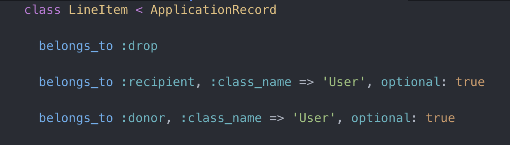
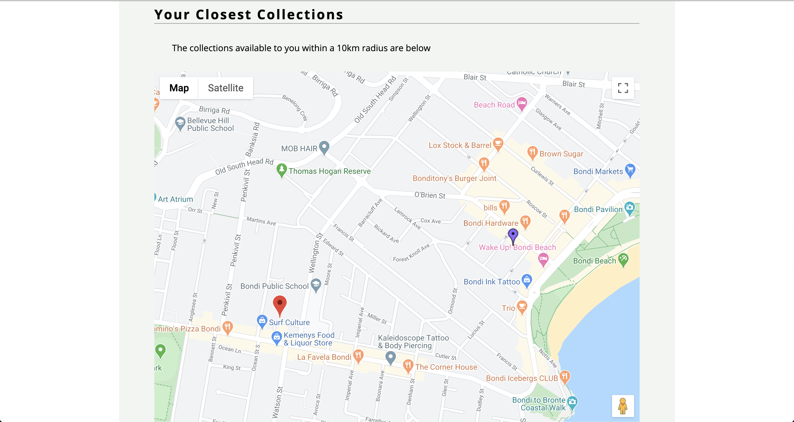

# One - Organising the Outreach

## Purpose of the site

There is a big issue surrounding the Australian bushfire support. People are donating locally, to community centres and clubs. But they are struggling to handle the volume and organising where the donations are actually going. I hope to make this easier by building an application where users can request or donate items based on collections created by other users.

## Aim of the site

- Donors will know what products are most in demand
- Donors will know when to buy goods
  - When / where collections are organised
  - When / where they are being delivered
- Donors know what locations are highest in demand
- Donors know products other people are donation so don't over buy

## Deployed Project Link

http://jaytees-one.herokuapp.com

## Style

- Bright / cheerful
- Soft around the edges

## Tech / Framework Used

- Ruby
- Ruby on Rails
- Jquery
- CSS
- Geocoder / Google Maps API
- Heroku

## Experience and Process

- It was really fulfilling to apply myself to solve a real world problem as it unfolded. It also adds a very user centric approach in planning and how I prioritised feature development. Always questioning what best solves the problem.
- As this was my first time building a full-stack application, I had to make sure I was splitting my workload effectively. I decided to do this on a feature basis, inline with the user centric approach mentioned above. Defining my MVP functionality and then extensions on this. This followed the below structure;
  - User signup and login
  - Create drop
    - Display requested products
    - Request or donate products
  - Drop feed in ascending chronological order
  - Display most requested products
  - Integrate map to display collections and deliveries
- Once I had planned my attack, it was time to start developing the functionality to facilitate this.
- I used Ruby on Rails for the MVC architecture.
- Beginning with the Models, I used a line item concept to achieve the duality necessary for the user and product tables.
- Once thoroughly tested in the Rails console, I wire-framed the front-end and focussed on the Controllers and Views.
- Using partial form rendering to achieve the functionality I was after in the Views and focusing on the CRUD operations for the controllers.
- Finally, I integrated the Google Maps Api to display local collections or deliveries based on user location.

## Wins

- Partial Rendering - Perhaps the achievement I am most proud of is my use of partial view rendering to create an almost component based SPA interface. I have since learnt I was pushing the functionality of partial rendering in the direction that framework's like React and Vue were designed to build. Through using this functionality I was able to have elements/forms that were controlled by different controllers all grouped in one 'parent element'. Main example would be the drop feed display and how it is dependent on 2 different line item forms rendered within it. There were obviously some drawbacks from the lack of a virtual DOM to re-draw elements that were updated. But this is just the way I envisioned my app to function and I'm really happy with how close I managed to get it.
- Model Associations - Duality for user and product models. By using 3 foreign keys, I achieved diverse functionality from one user table. Allowing a user to be either the organiser of a drop, the donor of a product or the requester of a product. This solved the issue of having to create multiple User tables for a donor and recipient and allowed me to have multiple users linked to drops.
- Maps and Conditional Rendering - The Google Maps API and Geocoder obviously made this functionality more accessible but I'm really happy with with the results I managed to achieve with some customisation. One map will show the user's location and the location of the selected collection. The other map will show the user's location and collections within a 10km radius. Which map is rendered is based on the evaluation of the built in controller_name and action_name variables in a conditional.

## Challenges

- Model Associations - Although already mentioned above in the wins section this was one of my biggest hurdles. The complexity was that products needed to be present on multiple drops at any given moment and each instance needed to allow a user to be either a donor or recipient. To tackle this I had to break the problem into two. I had the product and drop association and the user type association.

  Upon research I found the line item shopping basket concept best suited my situation for product and drop association. Being that a drop was essentially a users shopping basket, as multiple shopping baskets could contain different instances of the same product. So this would structure would facilitate the join I required.

  To achieve the user association took a lot of digging into the Active Record Rails documentation, until I finally came across foreign keys. Once I understood that a table could be referenced under an alias or multiple, I realised a user whether a recipient or donor was same it was just saved respective to its function in that instance.

- Home Page Conditional Rendering - I dreamt up an idea for the home page which required a different page structure to the rest of the site. For the homepage I needed a full viewport width background and the rest of the site is rendered within a div container with a fixed 70% viewport width. To achieve my goal I had to learn about conditional rendering and combine this with the partial rendering I had already learnt. I also found the built in controller_name and action_name variables. With these I was able to evaluate which controller and action was handling the view and based on this define which view to yield.

## Code

- Line item user associations
  
  

- Partial form rendering - drop feed display

  - Render the partial for drop feed
    
  - Display the products that have already been requested for this drop
    
    
  - Allow a user to be able to donate and request products for this drop
    
    

- Home Page - using built in controller name and action name
  

## Screenshots

- Landing Page

- Drop Feed

- Commit to requested products by drop

- Donate or request products by drop

- Map Example

## Things to do

- CSS still needs work, specifically forms and nav bar
- Mobile responsiveness needs to integrated
- Add more interactivity
- Search facility by location
- Email verification

## Known bugs

- Mobile responsiveness is terrible
- When donations are made, check to see if any product requests exist without donors assigned
