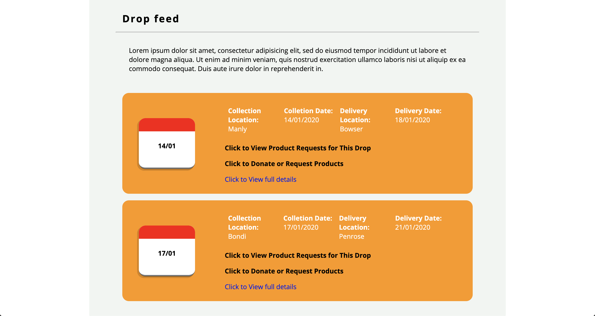

# One - Organising the Outreach

## Purpose of the site

There is a big issue surrounding the Australian bushfire support. People are donating locally, to community centres and clubs. But they are struggling to handle the volume and organising where the donations are actually going. I hope to make this easier.

## Aim of the site

* Donors will know what products are most in demand
* Donors will know when to buy goods
  * When / where collections are orgainised
  * When / where they are being delivered
* Donors know what locations are highest in demand
* Donors know products other people are donation so don't over buy

## Style

* Bright / cheerful
* Soft around the edges

## Tech / Framework Used

* Ruby
* Ruby on Rails
* Jquery
* CSS
* Geocoder / Google Maps API
* Heroku

## Things to do

* CSS still needs work, specifically forms and nav bar
* Mobile responsiveness needs to integrated
* Add more interactivity
* Search facility by location
* Email verification

## Known bugs

* Mobile responsiveness is terrible
* When donations are made, check to see if any product requests exist without donors assigned

## Link to Live Site

http://jaytees-one.herokuapp.com/

## Screenshots

* Landing Page

* Drop Feed

* Map Example

* Drop Feed

